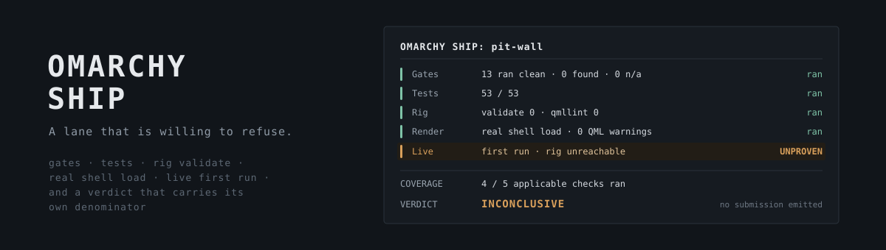

<p align="center"></p>

# omarchy-ship

A pre-submission lane for [Omarchy](https://omarchy.org) plugins that refuses to
report success for anything it did not actually check.

It is a [Claude Code](https://code.claude.com) plugin: one skill, `/omarchy-ship`,
and the three subagents it delegates to.

[](https://ko-fi.com/U5S225PTME)

**Links:** [Omarchy plugin marketplace](https://plugins.omarchy.org) ·
[Submission and verification docs](https://github.com/omacom/omarchy-plugin-marketplace) ·
[Plugins this lane ships](https://oma.intentsolutions.io/) ·
[Canonical gate lane](https://github.com/jeremylongshore/contributing-clanker)

## Why this exists

Every layer of an Omarchy plugin's verification has, at some point, reported
green without having checked anything:

| Layer | How it lied |
| --- | --- |
| Gate lane | Two gates skipped when the rig binaries were missing, and the runner counted SKIP as PASS. It printed `verdict PASS, 0 BLOCK` for plugins that had never run on Omarchy. |
| Empty corpus | A gate answered PASS about QML overflow in a tree containing no QML. |
| CI review | Jobs gated on an unset variable skip, and four skipped jobs render as four grey ticks that read as four completed reviews. |
| Static validation | `omarchy-plugin-validate` and `qmllint` are both static. A wrong QML contract passes both and fails on load. |
| Rig render | The render seeds the plugin's cache from a small fixture, so a dead endpoint renders identically to a working one. A release was 76 tests, 13/13 gates and a clean render green while no real user could load any data. |
| Working tree | Fingerprints built from `find .` hashed ignored debris, so a receipt disagreed with the commit it certified. Green in CI, blocked on a developer disk, same commit. |
| Submission guard | The filing hook matched the marketplace by its old repo name. After the repo moved orgs, filing skipped the gates with no message. |

The through-line is one defect: **a component reporting a conclusion whose scope
it never established.** This lane is built so that cannot happen quietly.

## What it does

`/omarchy-ship <plugin>` runs five layers, all of them even if an early one fails:

1. **Gate lane.** The vendored content gates, checked against canonical first so a stale lane cannot report clean against its own smaller denominator.
2. **Offline tests.** The repo's own suite.
3. **Rig validation.** `omarchy-plugin-validate` and `qmllint` on a real Omarchy image.
4. **Rig render.** Loads the plugin into a real isolated shell and treats any QML warning as a finding.
5. **Live first run.** For a plugin that touches the network: empty cache, real network, and an assertion from inside the shell that the plugin fetched real data, plus a control that must fail. A plugin with no network path marks this not applicable, never passed.

It then hands the raw results to two subagents that are deliberately separate:
one counts what actually ran, one judges whether it should ship. A reporter that
can also repair what it measures cannot be trusted about what it measured.

The answer is exactly one of three words:

| Verdict | Meaning | Emits a submission |
| --- | --- | --- |
| **CLEAN** | Every applicable check ran and none found anything | Yes, printed for review, never filed for you |
| **FINDINGS** | A check ran and found something | No |
| **INCONCLUSIVE** | An applicable check could not run | No |

`INCONCLUSIVE` is not a failure and it is not a pass. It means nobody knows yet.
A lane that always produces a submission is a lane whose verdict carries no
information.

## Install

```
/plugin marketplace add jeremylongshore/omarchy-ship
/plugin install omarchy-ship@omarchy-ship
```

Or clone it and copy `skills/omarchy-ship` into `~/.claude/skills/` and the files
in `agents/` into `~/.claude/agents/`.

## What you need

This is the honest part. The skill is portable. The infrastructure it drives is
not something it can conjure:

- `git`, `jq` and `docker` on `PATH`.
- A checkout of [contributing-clanker](https://github.com/jeremylongshore/contributing-clanker) for the canonical gate lane.
- **A rig:** a container running a real Omarchy shell that you can reach, for layers 3 to 5. The scripts in the entry repos default to a host named `intent-ops-buzz`; set `OMARCHY_RIG_HOST` to yours. Without a rig the lane still runs layers 1 and 2 and reports the rest as UNPROVEN, which is the correct answer.
- A plugin built from [omarchy-widget-template](https://github.com/jeremylongshore/omarchy-widget-template), which carries the `scripts/rig-verify.sh`, `scripts/rig-render.sh` and vendored gate lane this skill calls.

## What is in here

```
skills/omarchy-ship/
  SKILL.md                          the lane
  references/submission-format.md   the marketplace issue forms, verbatim headings
  references/defect-classes.md      eleven defect classes, each with the incident behind it
  evals/evals.json                  behavioral evals for the skill
agents/
  omarchy-coverage-reporter.md      separates NOT APPLICABLE from UNPROVEN, returns a denominator
  omarchy-submission-auditor.md     judgment: stock-box install, QML security invariants, idiom
  omarchy-plugin-architect.md       design a plugin that passes the lane to begin with
```

`references/defect-classes.md` is the part worth reading even if you never run
the skill. Every entry shipped, or reached a marketplace reviewer, or was found
only by loading the plugin into a running shell.

## Status

Used to take sixteen plugins through the official Omarchy marketplace. The
marketplace process changes often; `references/submission-format.md` names the
authoritative docs and says when it was last checked against them.

## License

MIT. See [LICENSE](LICENSE).
